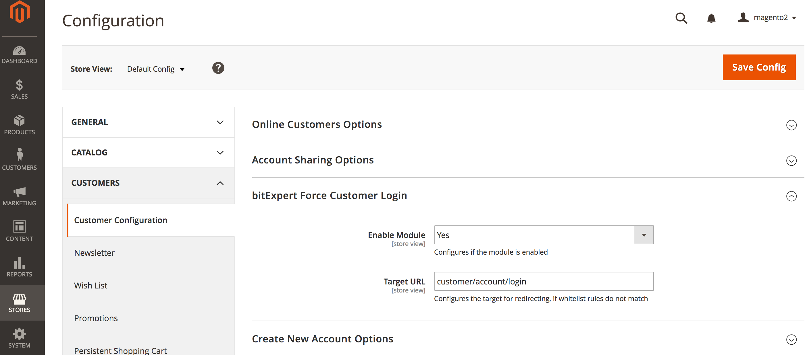
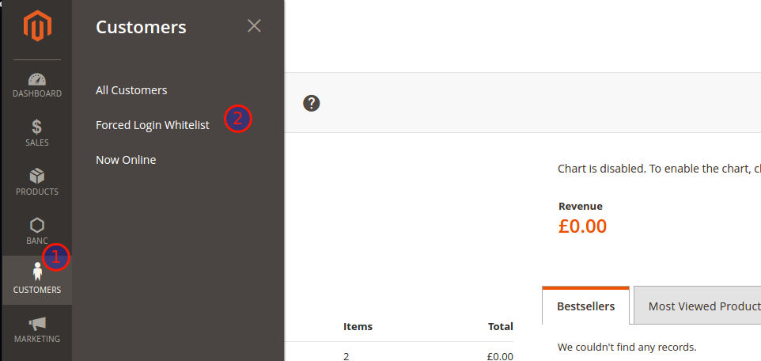
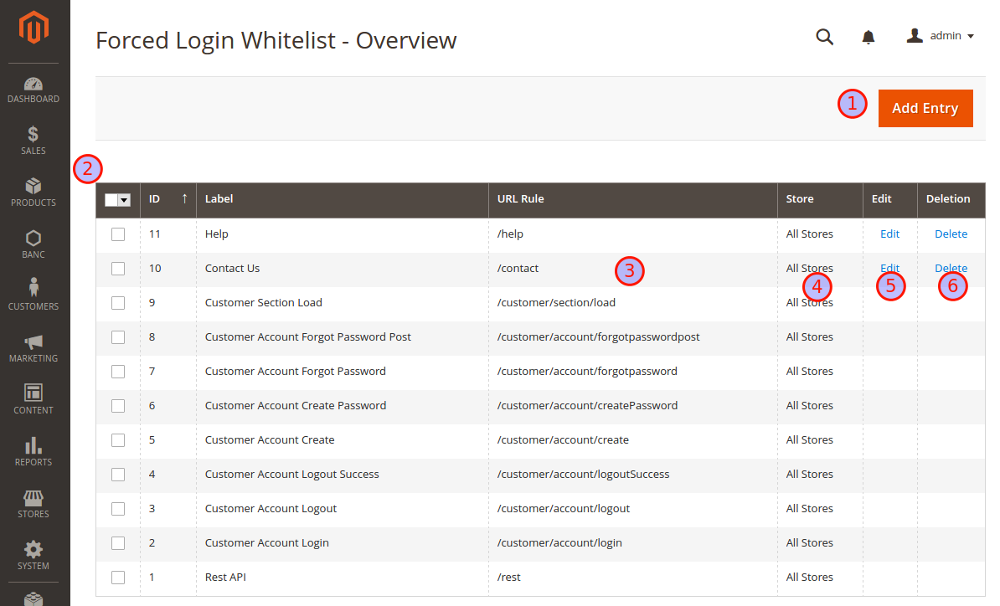

# Force Login Module for Magento® 2

[](https://travis-ci.org/bitExpert/magento2-force-login)

The **Force Login** Module for *Magento® 2* allows you to restrict which pages a visitor is
able to see. Visitors get redirected to the login page if the page is not marked visitable.
The **Force Login** Module for *Magento® 2* is especially useful for merchants serving only a specific
group of users, e.g. enterprise related business partners and need to ensure that only those users are
able to browse the the website or the product catalog.

## Features:
* Force your guest visitors to log in first (or register), before allowing them to visit your pages and catalog
* Administration: Manage the whitelist rules by the GUI in the administration area
* ACL: Restrict the administration of whitelist rules to certain backend user groups
* Whitelisting: Define url rules as pattern to define which pages guest visitors can visit without logging in first
* Multistore-Support: Define if whitelist rules either apply globally or for specific stores

## Installation
The preferred way of installing `bitexpert/magento2-force-customer-login` is through Composer. Simply add `bitexpert/magento2-force-customer-login` 
as a dependency:

```
composer.phar require bitexpert/magento2-force-customer-login
```

Optional you can download the latest version [here](https://github.com/bitExpert/magento2-force-login/releases) and install the
decompressed code in your projects directory under *app/code/bitExpert/ForceCustomerLogin*.  

## Post-Install

After the installment of the module source code, the module has to be enabled by the *Magento® 2* CLI.

```
bin/magento module:enable BitExpert_ForceCustomerLogin
```

## System Upgrade

After enabling the module, the *Magento® 2* system must be upgraded. 

If the system mode is set to *production*, run the *compile* command first. This is not necessary for the *developer* mode.
```
bin/magento setup:di:compile
```

To upgrade the system, the *upgrade* command must be run.
```
bin/magento setup:upgrade
```

## Clear Cache

At last, the *Magento® 2* should be cleared by running the *flush* command.
```
bin/magento cache:flush
```

Sometimes, other cache systems or services must be restarted first, e.g. Apache Webserver and PHP FPM.

# User Guide
Find the complete user guide [here](./docs/UserGuide.pdf "User Guide").

## How to use
The usage of the **Force Login** Module for *Magento® 2* is applied implicitly by redirecting visitors 
if the called URI does not match any configured whitelisted url rules.

### Whitelisting

Whitelisting is based upon the usage of rules. The strategy selection defines how the rules are interpreted, [details are listed below](#strategies).
By default, some static rules are already listed. The following example shows, how to add a whitelist entry for the homepage (startpage).

Navigate to the **Overview Grid** and use the *Add Entry* button.

- Enter **Homepage** into the text field beside from the **Label** label.
- Enter **^/?$** into the text field beside from the **Url Rule** label.
- Select **All Stores** from the selection field beside from the **Store** label.

Use the **Save** button in the upper menu. After being redirected to the **Overview Grid**, the new 
entry should appear to the list and the systems homepage should be available for guest visitors.

## How to configure

### Administration

The **Force Login** Module for *Magento® 2* allows you to enable or disable the module itself on the level of websites, stores and store views.

If the module is *disabled*, the whitelist ruling and the redirection are not applied. If the module is *enabled* based upon the configuration,
the whitelist rules are process, which themselves are also configurable for all enabled stores or just specific ones.

After installing and enabling **Force Login** Module for *Magento® 2* with the CLI, you must be able to navigate to 
*Stores > Configuration > Force Login*, where you are able to configure the availability of the module for each website, store and store view.

In the administration configuration, you are also able to setup the URL the redirecting is targeting to if not whitelist rule is matching.



### Navigation
Navigating through the *Magento® 2* backend menu by clicking onto **Customers** you must see a new menu 
entry **Forced Login Whitelist**. 

Enter this menu entry.



### Overview Grid
You can add new entries by clicking on the *Add Entry* button in the upper right corner ( **1** ), [see below](#detail-form). 
The grid ( **2** ) contains all existing whitelisted *Url Rules*, for which the forced redirect to the *Customer Login Page* is omitted.
The *Url Rules* ( **3** ) are part of a regular expression checking on the called *Url* and tries to match against the whitelist.
*Url Rules* may be related to all stores or to a specific one ( **4** ). All rules except some mandatory ones are editable ( **5** ) and removeable ( **6** ).



### Detail Form
You can return to the *Overview Grid* by using the *Back* button ( **1** ). The *Label* value has only declarative character and
is for information purpose only ( **2** ). The *Url Rule* is an expression checking on the called 
*Url* and tries to match against the whitelist ( **3** ). *Url Rules* may be related to all stores or to a specific one ( **4** ).
The strategy selection ( **5** ) defines how the *Url Rule* is interpreted, [details are listed below](#strategies).
Persist the rule by using the *Save* button ( **6** ).


### Strategies

#### Static
Rule is used as a literal value and will be added onto the base url for matching. This is default behaviour. 

#### RegEx-All 
Rule is based on [regular expression](https://en.wikipedia.org/wiki/Regular_expression), and will be used for looking up matching anywhere in the current Url.

## Tests

You can run the unit tests with the following command (requires dependency installation):

    composer test

## Contribution
Feel free to contribute to this module by reporting issues or create some pull requests for improvements.

## License
The **Force Login** Module for *Magento® 2* is released under the Apache 2.0 license.
